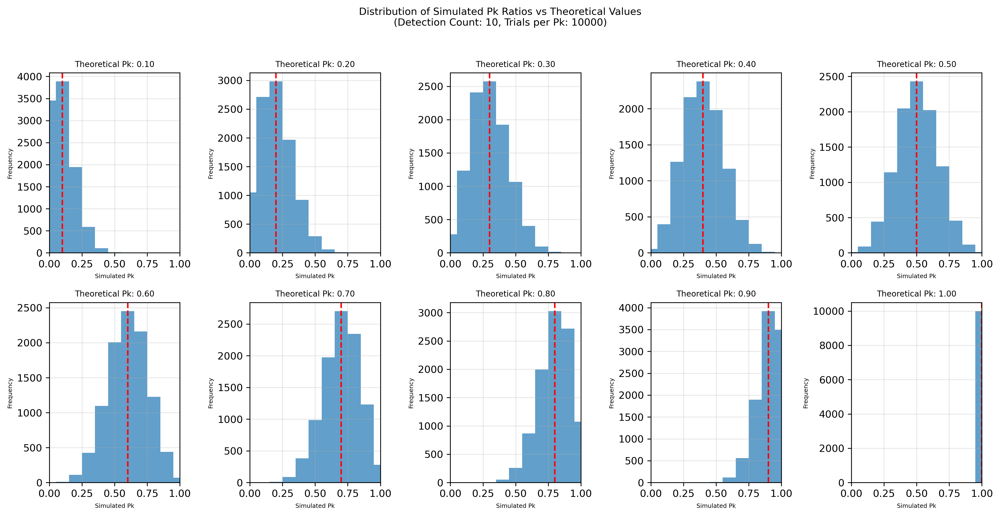
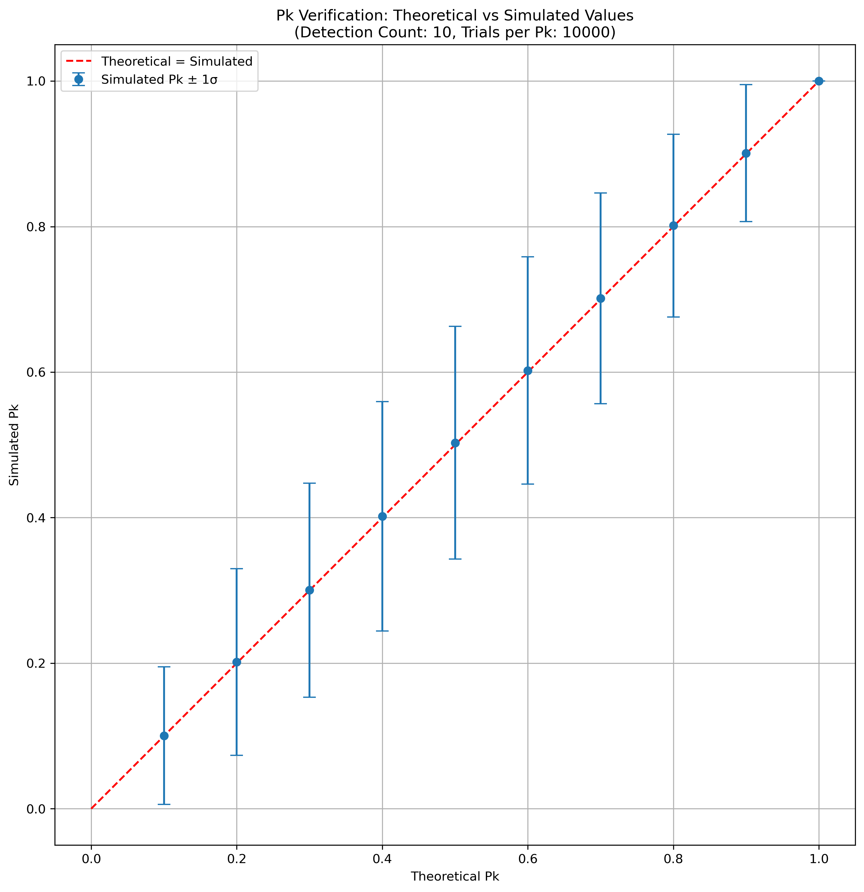

# MissileDefenseSimPy
A Python-based simulation for a Patriot Air Defense System, designed to detect and neutralize hostile threats using radar signals.

[](https://github.com/cfortunylombra/MissileDefenseSimPy/graphs/commit-activity)  

## Overview

This project simulates the detection and engagement process of a Patriot Air Defense System. It processes radar data from a CSV file, detects hostiles based on binary patterns, and simulates engagements with a defined Probability of Kill (Pk). Results are logged for analysis.

## Features

- **Radar Data Processing**: Reads binary data from CSV to simulate radar signals.
- **Hostile Detection**: Detects hostiles by analyzing odd/even binary patterns.
- **Engagement Simulation**: Engages detected hostiles with a configurable success rate (Pk).
- **Reproducible Results**: Supports random seed for consistent simulation outcomes.
- **Real-Time Simulation**: Optional 1-second delay per time step for realism.

## Project Structure
    .
    ├── main.py # Main script to run the simulation
    ├── src/
    │ ├── functions.py # Contains the PatriotAirDefenseSystem class
    │ └── radar_data.csv # Sample radar data (semicolon-separated binary values)
    └── output/ # Output directory for seeds 0-10
    │ ├── log_0.txt # Example log file (seed=0)
    │ ├── results_0.txt # Example simulation results (seed=0)
    │ ├── ...
    │ ├── log_10.txt # Example log file (seed=10)
    │ ├── results_10.txt # Example simulation results (seed=10)
    ├── extra/                 # Extended analysis scripts
    │ ├── large_scale_test.py  # 10^4 row simulation
    │ ├── binary_data.csv  # New radar data generated with 10^4 rows
    │ ├── large_scale_log_42.txt # Example log file for large_scale_test (seed=42)
    │ ├── large_scale_results_42.txt # Example results file for large_scale_test (seed=42)
    │ ├── pk_analysis.py       # Pk ratio verification
    │ ├── Pk_histograms.png    # Generated histogram plot
    │ └── Pk_verification.png  # Generated verification plot
    ├── Code_Assessment_TNO.pdf # Instructions
    └── README.md

## Prerequisites

- Python 3.x
- numpy (for `extra` folder)
- matplotlib (for `extra` folder)

Required for `extra` scripts, install dependencies:

    pip install numpy matplotlib

- **Note**: Here, `/` is used for paths on Linux and macOS, while `\` is used on Windows.

## Usage

1. **Clone the repository**:
   ```bash
   git clone https://github.com/cfortunylombra/MissileDefenseSimPy.git
   cd MissileDefenseSimPy-main

2. **Run the simulation:**:
    ```bash
    python main.py 

3. **View results**:
    - Check `output/log_0.txt` for detailed step-by-step logs ("_0" suffix indicates random seed=0).
    -  Check `output/results_0.txt` for aggregated simulation statistics ("_0" suffix indicates random seed=0)

4. **Extended analysis (extra folder)**:
    ```bash
    python extra/large_scale_test.py  # 10,000 time step simulation
    python extra/pk_analysis.py       # Generate verification plots

## Configuration Parameters (in `main.py`)

- `rng_number = 0`: Random seed for reproducibility (determines output filenames, e.g., `log_0.txt`).
- `Pk = 0.8`: Probability of successful engagement (0.0 to 1.0).
- `time_bool = True`: Enable 1-second delay per time step for real-time simulation.

## How it works?

1. **Radar Data**: Each CSV row represents a time step with 11 binary numbers.
2. **Odd/Even Analysis**: Hostile detected if more binary numbers end with 1 (odd) than 0 (even).
3. **Engagement**: If detected, a missile is launched with an 80% success chance (configurable via `Pk`).

## Example Output 

Log File (`log_0.txt`):

    Time step  5s: Radar data ['0110100', '1011111', '0101101', '1010111', '1101011', '0010001', '1011111', '1111010', '0100100', '1000110', '0101010']
    Hostile detected & Missile launched! Engaging target...
    Hostile identified & Missile neutralized the target.

Result File (`results_0.txt`):

    --SIMULATION RESULTS--
    Total Hostiles: 20
    Hostiles Detected: 10
    Probability of Detection: 50.00%
    Hostiles Identified: 9
    Probability of Identification: 45.00%
    Simulated Pk Ratio [#Identification/#Detection]: 0.90


## Customization 

- **Modify Radar Data**: Update `src/radar_data.csv` with new binary values (semicolon-separated).
- **Adjust Parameters**: Change `Pk`, `rng_number`, or `time_bool` in `main.py`.

## Extended Analysis

The `extra` folder contains additional results:

1. Large-Scale Test:

    - Simulates 10,000 time steps with random binary data (shown in `binary_data.csv`)

    - Demonstrates detection probability ≈50% (random generation)

    - Example Output:

        - Log File (`large_scale_log_42.txt`):

                Time step 97s: Radar data ['0100010', '0100110', '0110001', '1110101', '1011110', '0111001', '0110100', '0010011', '1011011', '0010100', '0001011']
                Hostile detected & Missile launched! Engaging target...
                Hostile identified & Missile neutralized the target.

        - Result File (`large_scale_results_42.txt`):

                --SIMULATION RESULTS--
                Total Hostiles: 10000
                Hostiles Detected: 5013
                Probability of Detection: 50.13%
                Hostiles Identified: 4032
                Probability of Identification: 40.32%
                Simulated Pk Ratio [#Identification/#Detection]: 0.80

2. Pk Ratio Verification:

    - Compares theoretical vs simulated Pk ratios

    - Generates histogram distribution and verification plot

    - Uses 10,000 random seeds per Pk value for statistical significance



